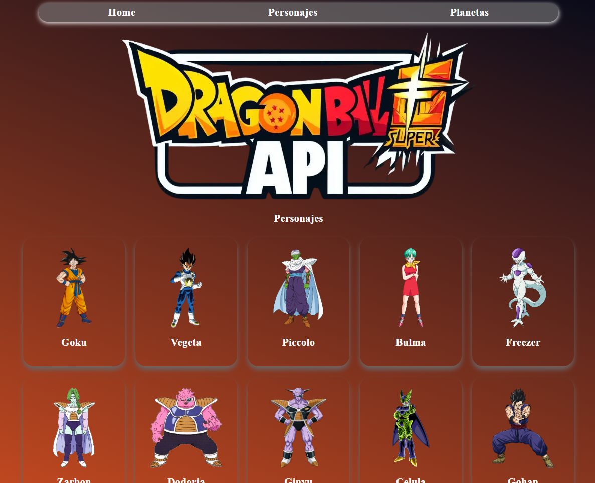
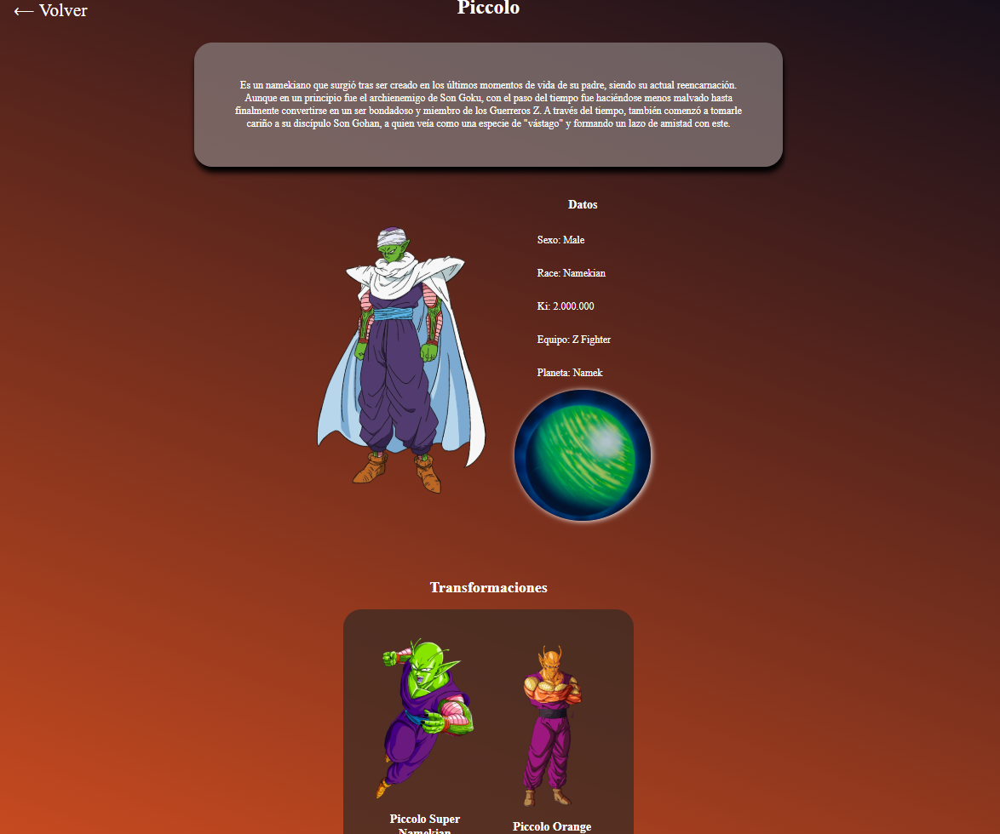

# 🐉 Dragon Ball Z API Explorer

Este proyecto es una aplicación **React + Vite** que se conecta a la **API pública de Dragon Ball Z** para mostrar información sobre personajes y planetas del universo Dragon Ball.

---

## 🚀 Tecnologías utilizadas

- ⚛️ **React** — Librería principal para la interfaz de usuario
- ⚡ **Vite** — Entorno de desarrollo rápido
- 🔁 **Redux Toolkit** — Manejo del estado global y asincronía
- 🌐 **Axios** — Para realizar peticiones HTTP a la API
- 🎨 **CSS** — Estilos personalizados y responsive

---

## 🧩 Funcionalidades principales

✅ Listado de personajes de Dragon Ball Z  
✅ Vista detallada de cada personaje  
✅ Listado de planetas y sus habitantes  
✅ Detalle individual de cada planeta  
✅ Paginación para navegar entre resultados  
✅ Indicador de carga mientras se obtienen los datos

---

## 🔗 API utilizada

Los datos provienen de la API pública:  
👉 [https://dragonball-api.com](https://dragonball-api.com)

Ejemplos de endpoints:

- `https://dragonball-api.com/api/characters`
- `https://dragonball-api.com/api/planets`

---

## 🖥️ Vista previa




---

## ⚙️ Instalación y ejecución local

1. Clonar el repositorio:
   ```bash
   git clone https://github.com/tuusuario/dragonballz-api-explorer.git
   ```
2. Entrar en el directorio del proyecto:

cd dragonballz-api-explorer

3. Instalar dependencias:

npm install

4. Ejecutar el servidor de desarrollo:

npm run dev

5. Abrir en el navegador:

http://localhost:5173

📸 Capturas
🔹 Página de inicio

🔹 Personajes

🔹 Planetas
